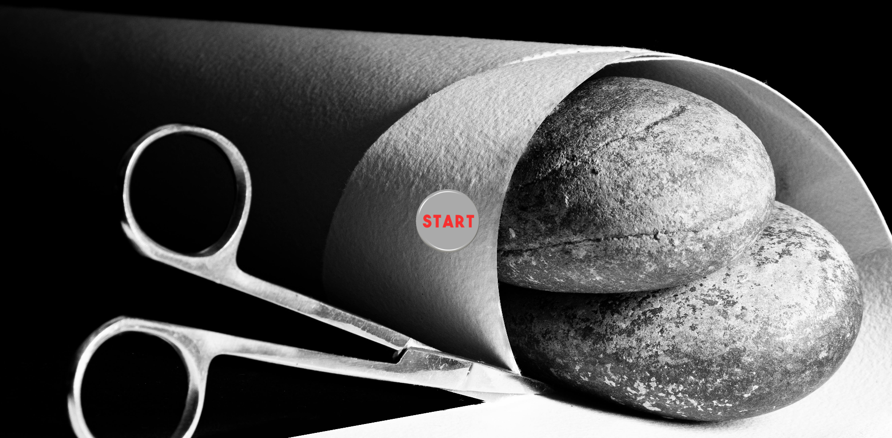
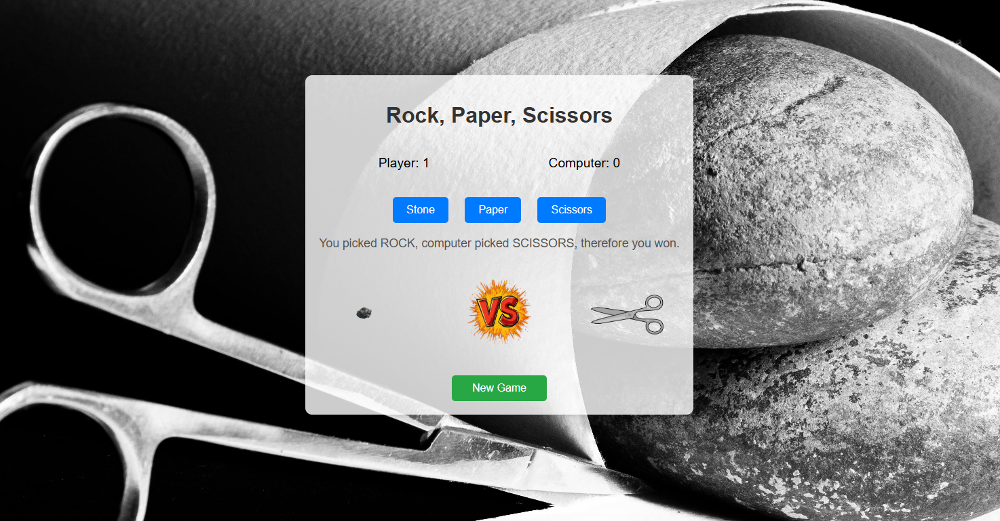
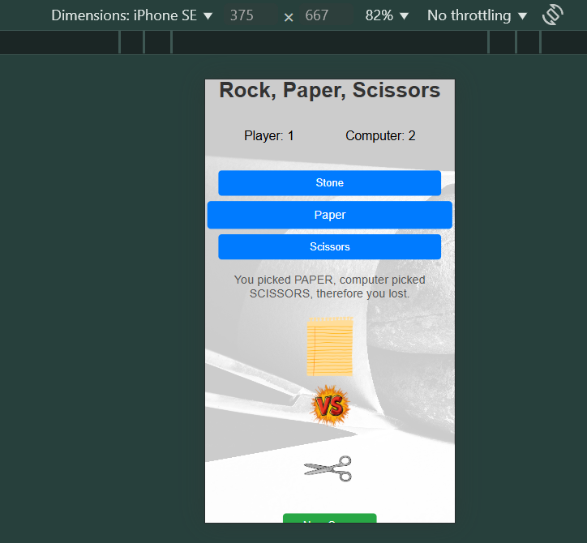
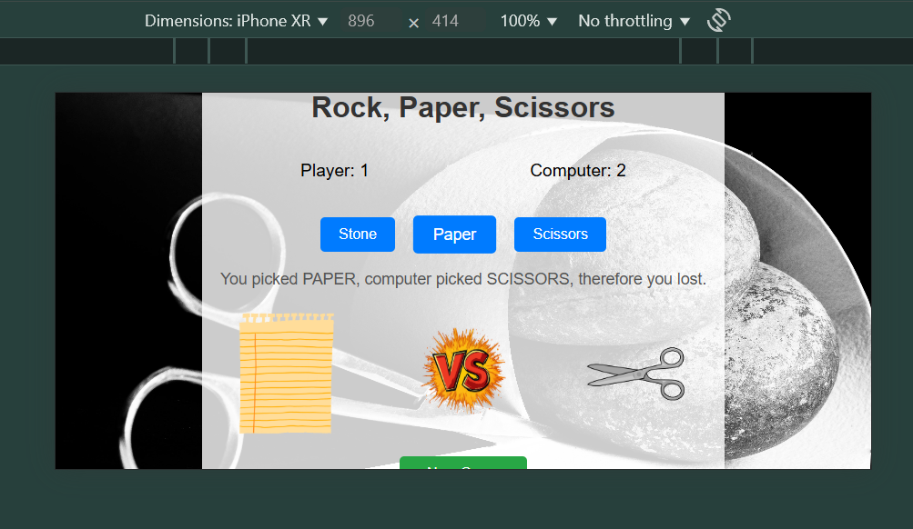

# Rock, Paper, Scissors Game

**Quick Look:** This is a polished Rock, Paper, Scissors game built with HTML, CSS, and JavaScript. It blends smooth animations, sound effects, and a responsive design to deliver a seamless experience across devices—all crafted from scratch to showcase my frontend skills. Curious? Dive in below!  
> ⬇️ Full project story & insights below — don’t miss the fun details!

---

## Features
- **Interactive Gameplay:** Select Rock, Paper, or Scissors and get instant results with a sleek VS animation.
- **Sound Effects:** Each action—choosing, winning, losing, or drawing—comes with polished fade-in/fade-out audio.
- **Score Tracking:** Monitors your score against the computer, with a reset option for a fresh start.
- **Responsive Design:** Adapts effortlessly to any screen size, from mobile to desktop.
- **Fast Loading:** Background image loads instantly using `rel="preload"` for a smooth launch.
- **Fallback Support:** Uses GIFs for animations, with PNG backups for broader compatibility.

## How to Play
1. Click the start GIF (or fallback button) to launch the game.
2. Choose Rock, Paper, or Scissors with a button click.
3. See the animated outcome and hear the result—win, lose, or draw.
4. Hit "New Game" to reset scores and play again.

## Why It Stands Out
This project highlights my strengths as a frontend developer, with a focus on usability and clean execution. Here’s what sets it apart:
- **Built from Scratch:** No pre-made templates or design tools like Figma were used—just pure code and creativity. It began as a portfolio exercise but evolved into a fully functional, engaging game.
- **Efficient Code Structure:** Strings are centralized as constants in `app.js`, enabling quick updates (e.g., text or language changes) in under a minute.
- **Modern JavaScript:** Leverages ES6 for concise, readable code—see commits `f48f08e5` and `784efd1f` for a clear example.
- **Performance Optimized:** Background image loading is near-instant (tested via Chrome DevTools), cutting a typical 300ms delay to almost zero.
- **Responsive Design:** Layouts adjust dynamically across devices, ensuring a consistent experience.
- **Enhanced Audio:** Sound effects feature smooth fade transitions, elevating the user experience.
- **Organized Codebase:** Split logically across files for maintainability:
  - **`index.html`:** Core structure.
  - **`assets/styles/app.css`:** Responsive styling and animations.
  - **`assets/scripts/app.js`:** Game logic, audio, and visuals.

## Future Potential
There’s room to grow—think multiplayer functionality, custom themes, or a leaderboard. The foundation’s ready for more!

## Screenshots
See it in action:
- **First Page:** 
- **Game Area:** 
- **Mobile View:** 
- **Horizontal Mobile View:** 

## Links
- **GitHub Repository:** [https://github.com/AliaminiCodes/GAME_Rock_Paper_Scissors](https://github.com/AliaminiCodes/GAME_Rock_Paper_Scissors)
- **Live Demo:** [https://aliaminicodes.github.io/GAME_Rock_Paper_Scissors/](https://aliaminicodes.github.io/GAME_Rock_Paper_Scissors/)

## About Me
I’m Ali, a frontend developer passionate about building intuitive, high-quality solutions. This project reflects my commitment to detail and user-focused design. Need a reliable coder for your next big idea? Let’s talk:  
- **Gmail:** [ali.amini.codes@gmail.com](mailto:ali.amini.codes@gmail.com)  
- **LinkedIn:** [AliAminiCodes](https://www.linkedin.com/in/ali-amini-codess)  
- **X (Twitter):** [@AliAminiCodes](https://twitter.com/AliAminiCodes)  
- **Instagram:** [@AliAminiCodes](https://www.instagram.com/AliAminiCodes)  
- **Telegram:** [@AliAminiCodes](https://t.me/AliAminiCodes)  
- **Reliability Note:** If the start GIF doesn’t load (due to browser quirks or slow networks), a "Start Game" button steps in—keeping the game accessible across all devices, including mobile. It’s a small tweak that shows my focus on seamless usability.

## Ready to Collaborate?
This game is more than a demo—it’s a testament to my ability to deliver polished, practical solutions. I’d love to bring this level of care and skill to your team. Let’s create something great together!